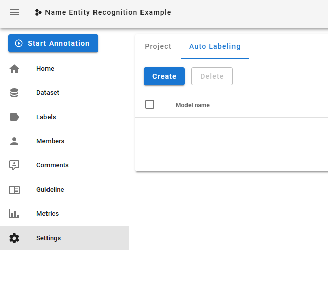
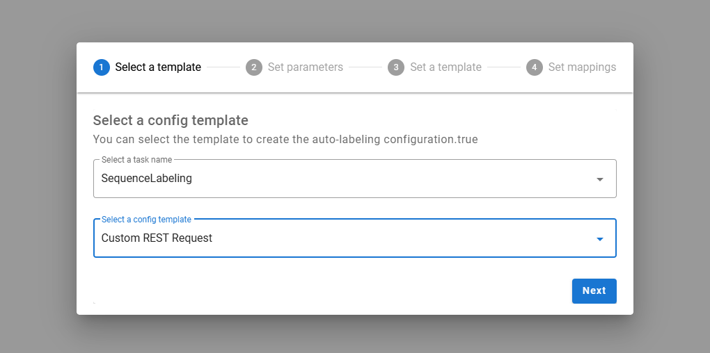
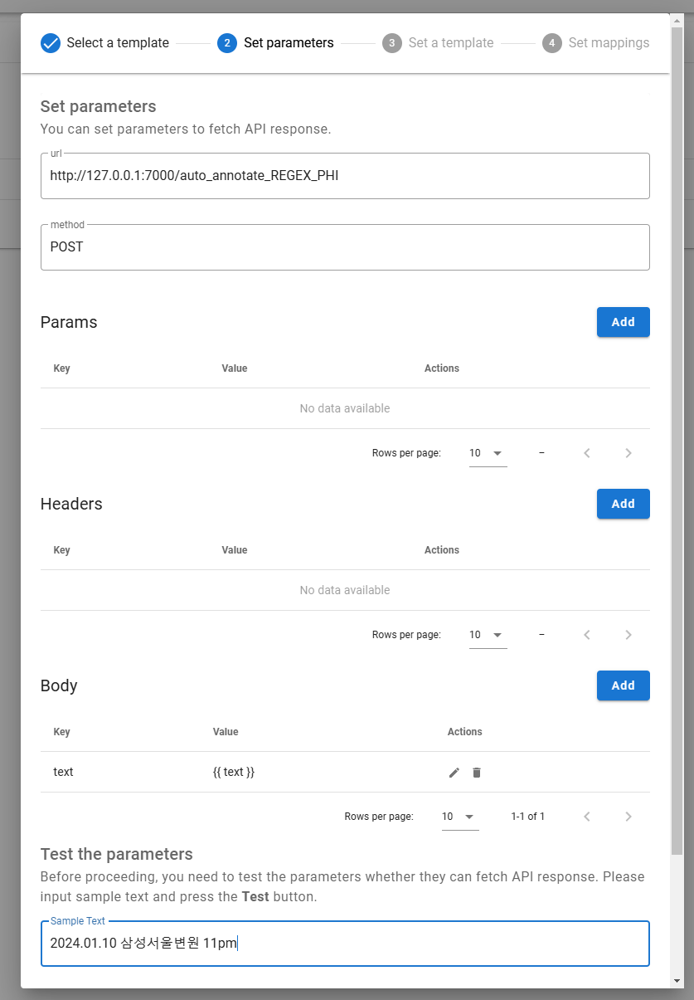
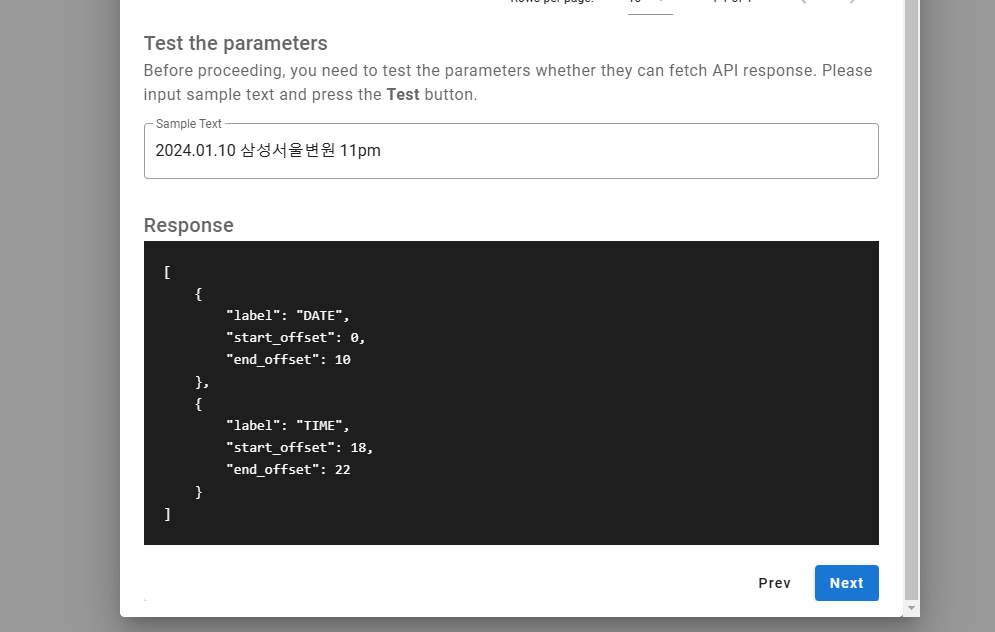

# SHL Autolabeling tool

Welcome to the SHL autolabeling tool. We use the open-source software doccano merged with our rule based and LLM based approach to automatically label Electronic Health Records (EHR).

The following is the explanation of how to set up the installation.

Notice: for having full access to the model approval will be required, therefore, please contact Smart Health Lab for the case.


### Step-by-Step Guide with Images

Follow these steps to set up and use the auto-annotation feature in connection with Doccano.

1. **Create an Auto-Labeling Configuration**  
   In Doccano, start by creating a new auto-labeling configuration.

   

2. **Choose Custom REST Request**  
   Select "Custom REST Request" as the type for the auto-labeling configuration.

   

3. **Add URL, Method, Body, and Test Parameters**

   - Enter the URL for either BERT or REGEX auto-annotation:
     - BERT: `http://127.0.0.1:7000/auto_annotate_BERT_PHI`
     - REGEX: `http://127.0.0.1:7000/auto_annotate_REGEX_PHI`
   - Set the method to `POST`.
   - In the request body, add `text: {{ text }}`.
   - Test the parameters using sample text, such as `2024.01.10 삼성서울변원 11pm`.

   

4. **Click on Next**  
   After testing, click "Next" to proceed to the next configuration step.

   

5. **Add the Mapping Template**  
   Configure the mapping template with the response format to capture `start_offset`, `end_offset`, and `label` for each entity. Use the following template:

   ```json
   [
       
           {
               "start_offset": {{ entity.start_offset }},
               "end_offset": {{ entity.end_offset }},
               "label": "{{ entity.label }}"
           },
       
   ]
   ```

6. **Click on Finish**
   Complete the configuration by clicking "Finish".

7. **Return to Your Project and Start Auto-Labeling**
   Go back to your project, and you're ready to auto-label using the new configuration!

Your setup is now complete! You can start auto-labeling PHI in Doccano using either BERT or REGEX-based annotation pipelines.
